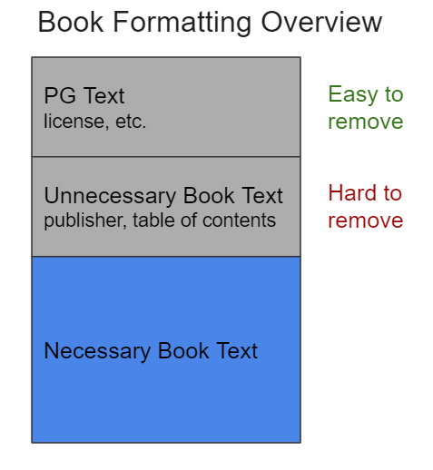
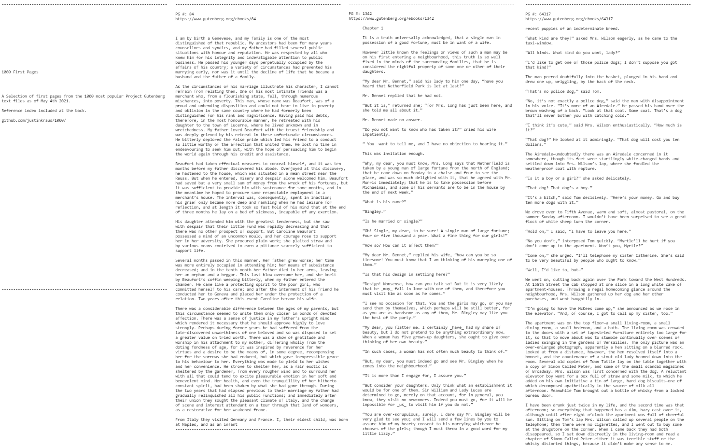

# 1000 First Pages
## The First Page From The 1000 Most Popular Project Gutenberg eBooks

Download the book here (its a 5mb plain text file): [1000 First Pages.txt](https://raw.githubusercontent.com/justinkraus/1000/master/1000_First_Pages.txt)

## Background
Project Gutenberg is a digital library with over 60,000 free eBooks. As a user, I'm often debating about what to read next. I typically download a bulk selection of titles based on familiarity or recommendation. However this isn't a very successful process as my selection criteria is not well informed, I'm often disappointed with what I read but the time consuming download process discourages me from revisiting Project Gutenberg. 

### A Tool For Discovery
1000 first pages is a solution to this: a text file that combines the first few pages of popular offerings on Project Gutenberg aggregated preview of popular offerings on Project Gutenberg. 

Features:

 - **Emphasis on reading** - Books are presented without any title or author information, encouraging the user to read instead of consider. This information and a direct link is provided at the end of the file.
   
 - **It's small** - A 5mb plain text file. Download and revisit without worrying about space.

## Process

### Obtain Books
This script was used to get the top 1000 Project Gutenberg titles in April 2021:
[Scrape Top 1000 List](https://github.com/justinkraus/1000/blob/master/01_scrape/01_top1000.py)

###   Download Books
The Project Gutenberg book ID's from the top 1000 were put into a [list](https://github.com/justinkraus/1000/blob/master/02_dlbooks/top_1k.py). 

I used the Python library [Gutenberg](https://pypi.org/project/Gutenberg/) to download the text of each book and supporting metadata like author and title. [Full script](https://github.com/justinkraus/1000/blob/master/02_dlbooks/02_pg_top1k_dl.py)

### Cleanup and Formatting
eBooks on Project Gutenberg include additional text before the primary book text. This additional text includes Project Gutenberg added text about the license as well as text from the book such as publisher info and table of contents. [Chapterize](https://github.com/JonathanReeve/chapterize), a Python library for formatting Project Gutenberg books was used to format the books.

As shown in the image above, the standardized Project Gutenberg text is easy to remove. However unstandardized information added by the publisher, like table of contents, is not easy to remove as it differs between books. I used regular expressions and manual cleanup to remove what was missed by chapterize but some unnecessary text is included.

Finally books were combined using the first 5000 words from each, [Full Script](https://github.com/justinkraus/1000/blob/master/03_combineBooks/pg_concat.py). Included at the end of the book is a list of titles. 

Preview image of the first few books:

Happy Reading!!

Final Version: [1000 First Pages.txt](https://raw.githubusercontent.com/justinkraus/1000/master/1000_First_Pages.txt)

## Final Thoughts
Future versions made include specific genre combinations or refreshes using other selection criteria, get in touch if you have any ideas.